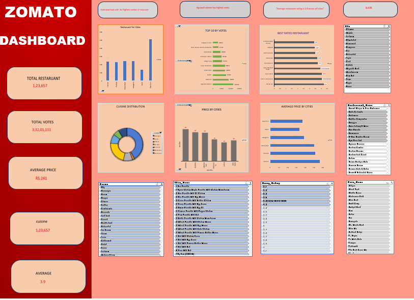
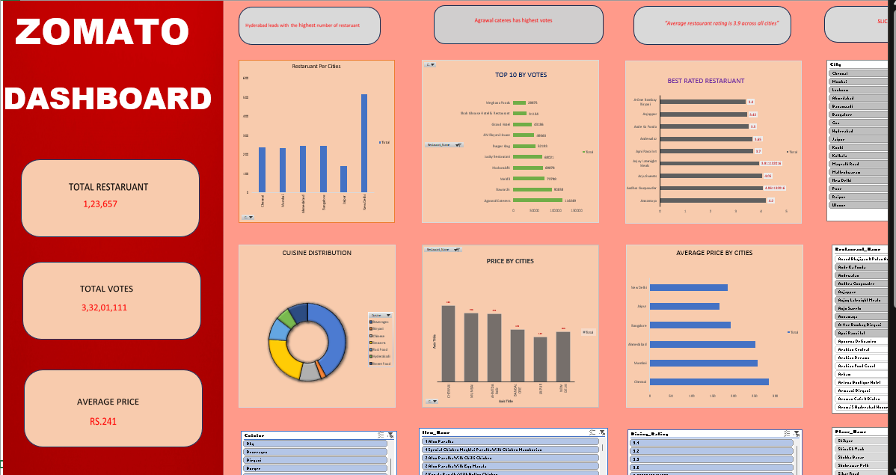
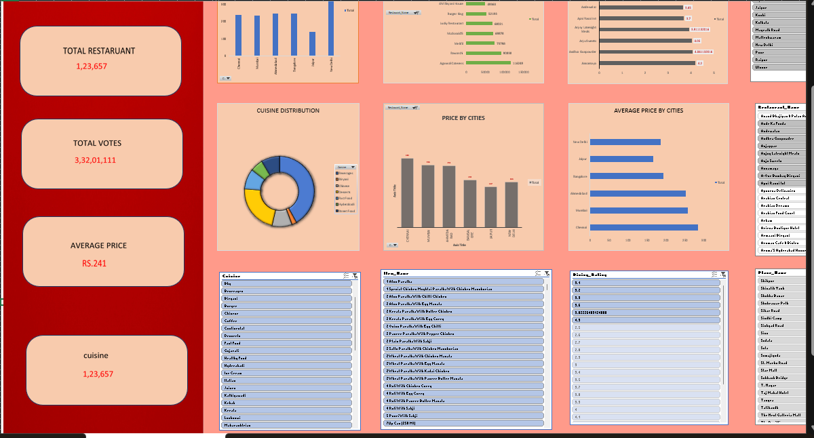

# zomato-_restaruant-_insights-repository-dashboard
This project analyzes Zomato restaurant data to identify trends in cuisines, pricing, and customer preferences.  
The dashboard provides interactive KPIs, charts, and slicers for business insights.
Data Cleaning:

->Removed duplicates, trimmed extra spaces, and standardized text (like city names, cuisines).

->Converted numbers into readable formats (Lakhs, K).

Data Analysis:

->Created pivot tables for KPIs:

->Total restaurants

->Cuisine distribution (e.g., American cuisine 371 restaurants)

->Rating analysis (Dining vs Delivery ratings)

->Votes and popularity by city

->Dashboard Building

->Used slicers for filters (City, Cuisine).

->Designed charts: bar, pie, column for visual clarity.

->Highlighted key insights with text boxes.

Key Insights (examples you can mention)

->hyderabad has the highest number of restaurants.
Dashboard Overview

Dashboard firstview

Dashboard finalview

American cuisine is most popular.

Top restaurant rating is 4.9.
